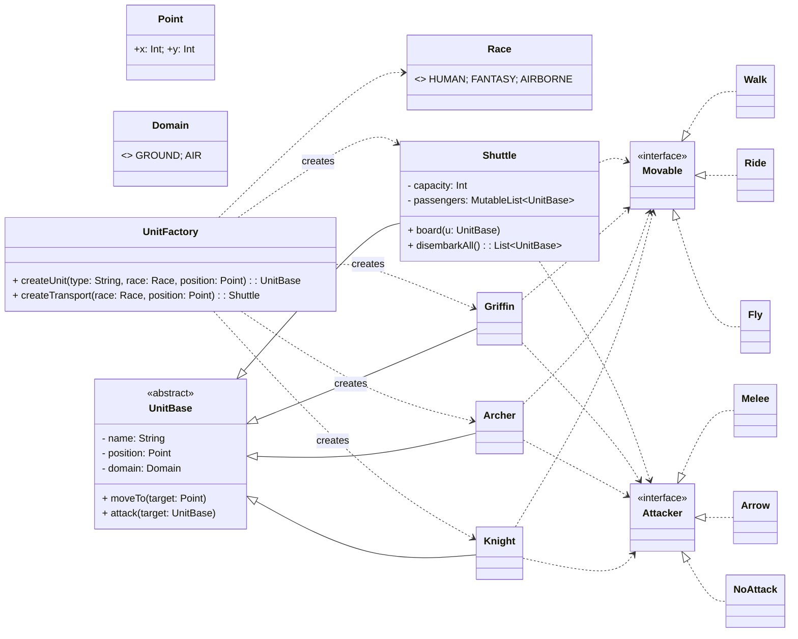

**RTS(Real-Time Strategy) 게임 캐릭터 시뮬레이션 과제**

> **과제명:** *게임 캐릭터와 행동 만들기 (homework02_GameCharacter.pdf)*  
> **제출 형태:** *Gradle 프로젝트 (gradle build / gradle run 가능 상태)*  
> **작성 언어:** **Kotlin**

---

### 1. 프로젝트 개요

중세시대를 배경으로 한 RTS 게임을 가정하여  
캐릭터(**Knight, Archer, Shuttle, Griffin**)의 **이동 · 공격 · 탑승** 동작을  
객체지향적으로 설계하고 구현한 프로그램입니다.

---

### 2. 구현 요구사항 요약

- **캐릭터 종류 및 규칙**
    - **Knight**: 말을 타고 이동, **지상만 공격 가능** (공중 유닛 공격 불가)
    - **Archer**: 걸어서 이동(느림), **지상/공중 모두 공격 가능**
    - **Griffin**: 날아서 이동, **하늘에서 지상만 공격**
    - **Shuttle**: 비행 유닛, **공격 불가**, Knight/Archer **최대 8기 탑승 가능**
- **탑승 분배 규칙**
  - Knight/Archer 32기는 **라운드 로빈(ROUND-ROBIN)** 으로 4대 Shuttle에 **균등 배치**
  - 분배 공식: i번째 병사는 **`i % 4`** 번째 Shuttle에 탑승
  - **정원 준수:** Shuttle 1대당 최대 **8명**
- 모든 행동은 `println`으로 **한글 메시지** 출력
- 각 캐릭터의 동작 규칙은 **다형성**으로 처리 (오버라이드)

---

### 3. 개발 환경

| 항목 | 버전 |
|---|---|
| **JDK** | 24 (OpenJDK 24.0.2) |
| **Kotlin** | 2.2.0 |
| **Gradle DSL** | Kotlin |
| **IDE** | IntelliJ IDEA 2024.2 이상 |

---

### 4. 프로젝트 구조

```text
game-character/
├─ build.gradle.kts
├─ settings.gradle.kts
├─ src/
│  └─ main/
│     └─ kotlin/
│        └─ rts/
│           ├─ Point.kt
│           ├─ Abstractions.kt
│           ├─ Units.kt
│           └─ Main.kt
└─ README.md
```

---

### 5. 실행 방법

#### 사전 조건
사전 조건: build.gradle.kts에
plugins { application } 와 application { mainClass.set("rts.MainKt") } 가 설정되어 있어야 합니다. (패키지 rts 기준)

#### A) Gradle로 바로 실행(권장)
```
./gradlew clean build
./gradlew run
```

#### B) 배포 스크립트로 실행
```
./gradlew installDist
./build/install/game-character/bin/game-character   # Win: ...\bin\game-character.bat
```

---

### 6. 객체지향 설계 포인트

| 원칙                           | 적용 내용                                                                                      |
|--------------------------------|-------------------------------------------------------------------------------------------------|
| Abstraction (추상화)           | 공통 행위를 `Movable`(이동), `Attacker`(공격) 인터페이스로 분리                                 |
| Encapsulation (캡슐화)         | `Shuttle`의 탑승자 목록을 `private`로 은닉, `board()`/`disembarkAll()`로만 상태 변경               |
| Inheritance (상속)             | UnitBase 상속으로 공통 속성(name, position, domain) 재사용, 이동/공격 행위는 인터페이스(Movable/Attacker) 계약에 따라 하위 클래스에서 구현                 |
| Polymorphism (다형성)          | 각 유닛이 `moveTo`/`attack`를 오버라이드하여 다른 로직을 같은 방식으로 호출                     |
| SRP / OCP (단일 책임/개방-폐쇄)| 규칙은 각 클래스에 단일 책임으로 배치, 새 유닛 추가 시 기존 코드 수정 없이 확장 가능            |
| Strategy (전략 패턴) | 이동·공격 로직을 Movable·Attacker 인터페이스로 분리하고, Walk/Ride/Fly, Melee/Arrow/NoAttack 전략을 주입해 유닛별 행동을 구성. 전략 교체만으로 확장(OCP), 불필요한 메서드 구현 제거로 ISP 준수 |

#### 알고리즘 포인트
- **라운드 로빈 균등 배치:** `idx % shuttles.size`로 32기를 4대 Shuttle에 고르게 분산
- **정원 제약:** `Shuttle.capacity = 8`을 초과하면 탑승 거부(출력 로그로 검증)
- **도메인 판정:** `Domain.GROUND/AIR`로 공격 가능 여부를 단순·명확하게 결정

#### 구조도



---
 
### 7. 실행 시나리오(검증용)

아래 시나리오가 `./gradlew run` 실행 시 **한글로 `System.out.println`** 로그로 출력됩니다.

#### 시나리오 개요
1. (0,0)에서 시작 좌표 설정 → 목표 지점 (10,10)
2. 유닛 생성: Knight 16기, Archer 16기, Shuttle 4대, Griffin 5기
3. 탑승: Knight/Archer 32기를 **라운드 로빈**으로 4대 Shuttle에 배치(정원 8)
4. 이동: Shuttle/Griffin이 (10,10)으로 이동
5. 하차: 모든 Shuttle에서 승객 하차
6. 전투:  
   - Knight: 지상만 공격(공중 공격 불가)  
   - Archer: 지상/공중 모두 공격 가능  
   - Griffin: 지상만 공격(공중 공격 불가)

#### 실행 로그 (발췌)
```text
=== RTS 게임 캐릭터 시뮬레이션 시작 ===
[1] Knight 16기, Archer 16기 생성. Shuttle 4대, Griffin 5기 생성.
[2] 셔틀 탑승 단계
Knight1가 Shuttle1에 탑승합니다.
...
Shuttle1 : 모든 승객을 내립니다.
Knight1가 내립니다.
Archer1가 내립니다.
...
[3] Griffin 5기와 함께 목표 지점으로 이동
Shuttle1가 날아서 (10, 10)로 이동합니다.
Griffin1가 날아서 (10, 10)로 이동합니다.
...
[5-1] Knight의 공격
Knight1가 Griffin1을 공격할 수 없습니다. (공중 유닛)
[5-2] Archer의 공격
Archer1가 Griffin1을 화살로 공격합니다.
[5-3] Griffin의 공격
Griffin1가 Shuttle1을 공격할 수 없습니다. (공중 유닛)
=== 시뮬레이션 종료 ===
```
